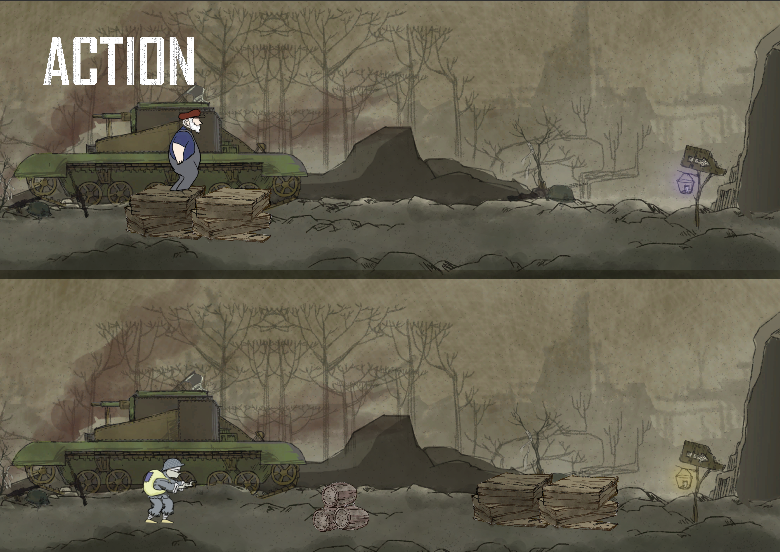
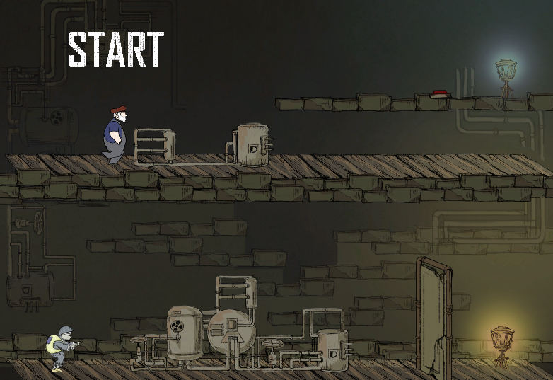
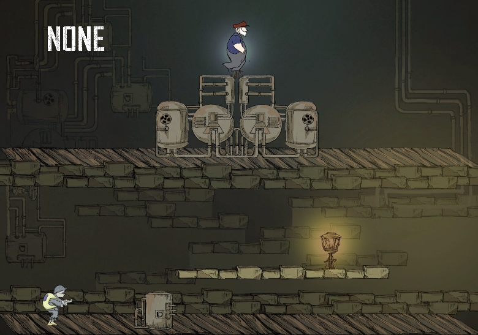

# Go-Home
This is a 2D game I made during 2019 Global Game Jam in GuangZhou, China. 

The story is about a son got his eyes injured in a war and his father needs to guide him the way home.

Player plays as father and the son will copy father's movement.

It did not win a price though :(

