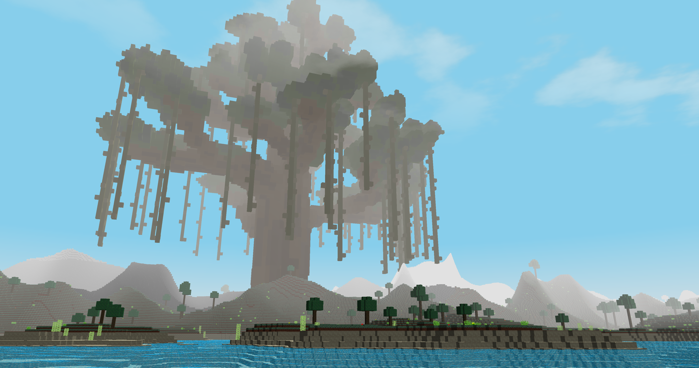
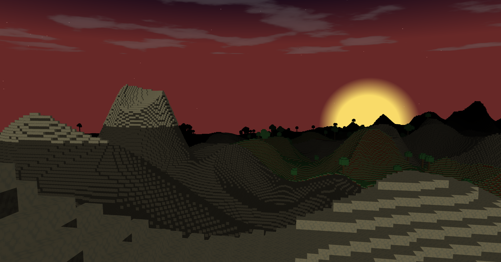
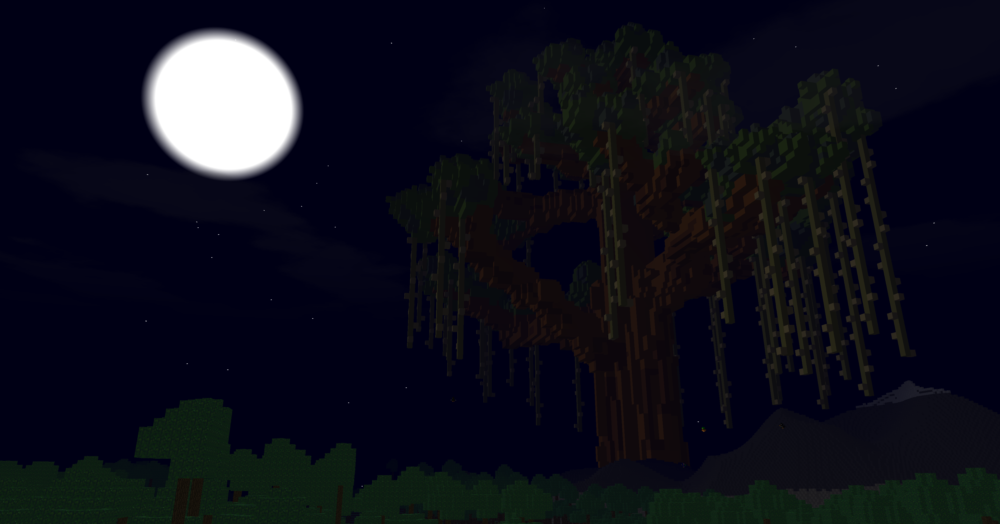
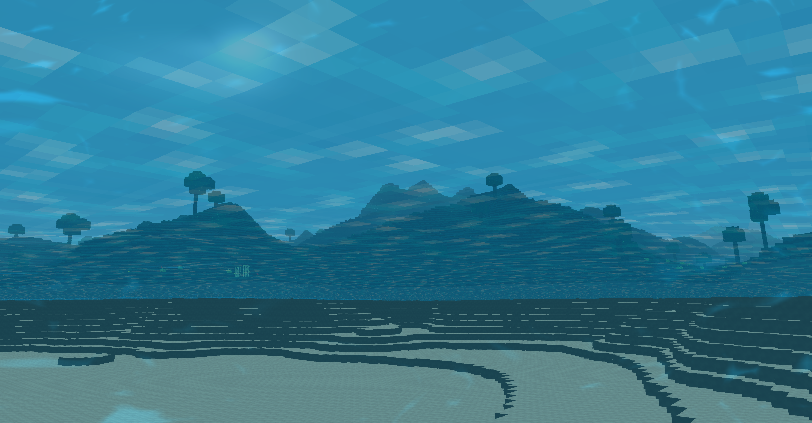

# **
Mini-Minecraft
**

This is an OpenGL project developed in QT5. Main features of this project include:

1. Efficient terrain rendering, including cube face culling and multi-threaded rendering.
2. Random generated boime by several noise functions combined.
2. Procedual sky, surise and sunset, stars.
3. Particle effect such as rain drops, dirt and sparkle.
4. Post-processing effect such as under warter effect and under lava effect.
5. Shader effect such as blinn-phone shaders in water.

video demo link: https://www.youtube.com/watch?v=WjiWeXH8jWU

Some sreenshots from this project:

