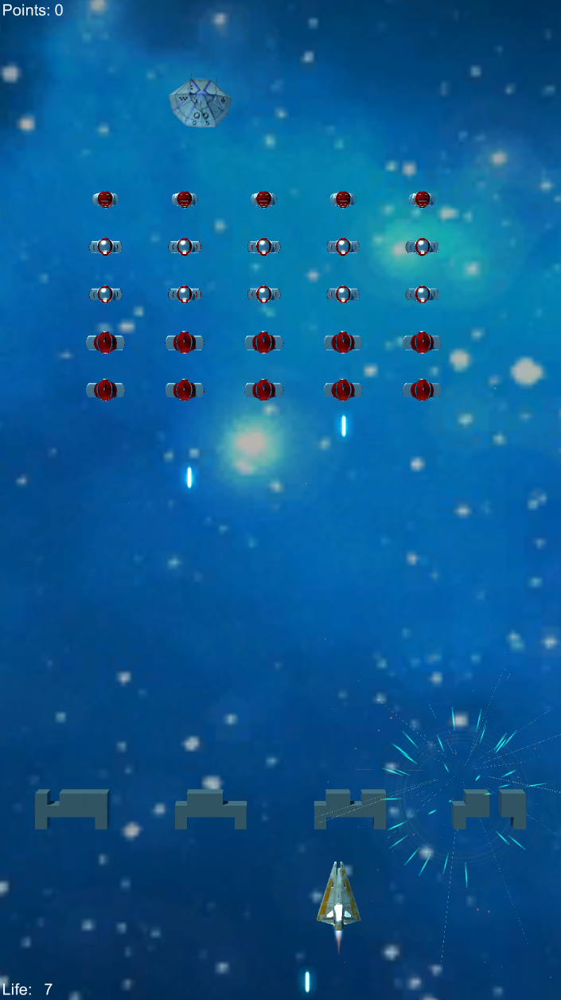
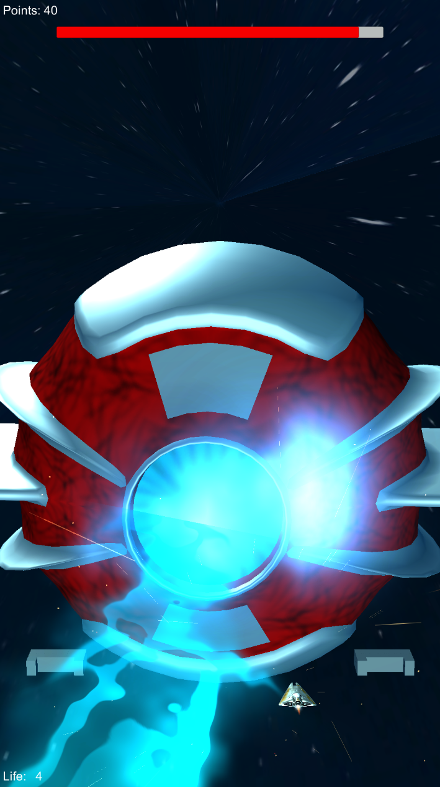

Hello, 

this repo is about some of the games I've made since 2016, some for fun and some for school projects.

Here is a quick look of each game:

**Mini-Minecraft**

video link: https://www.youtube.com/watch?v=WjiWeXH8jWU

**Calabash Brothers Protect Grandpa (Tower Defence)**

video link: https://www.youtube.com/watch?v=nFDN3rPHc6c

**Panda Lord Card**

video link: https://www.youtube.com/watch?v=skJvBKR3DMc

**MySpaceInvader**

video link: https://www.youtube.com/watch?v=fPgvIrXZVs0

